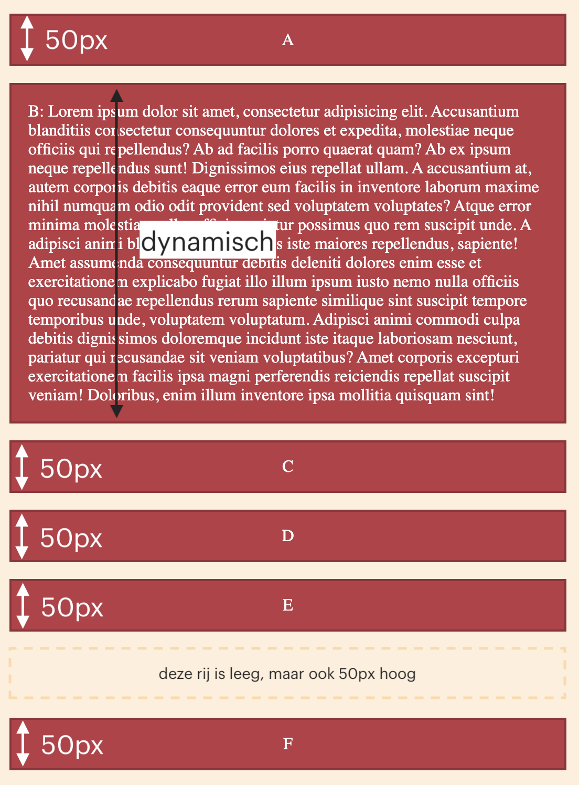

# Opdracht beschrijving

## Eindresultaat
Gebruik CSS Grid om de deze layout voor **desktops** te maken:

En zorg dat hij er zo uitziet op **mobiele** apparaten:

## Randvoorwaarden
* De afstand _tussen_ de blokken zijn `16px` voor zowel de kolommen als de rijen, op zowel _desktop_ als _mobiel_.
* Alle drie de kolommen hebben dezelfde breedte (en deze past zich aan aan de scherm-grootte).
* In blok B staan 150 woorden (_tip_: typ `lorem150` in jouw HTML en druk dan op de tab-toets). Dit blok past zich aan aan de content die erin staat.
* De afmetingen van de blokken staan vermeld op het screenshot.

## Stappenplan
Weet je even niet waar je moet beginnen? 🤯 Volg dan onderstaande stappen:
1. **Belangrijk:** Leg je PC of laptop even aan de kant en pak er papier en een pen/potlood bij. Teken bovenstaand plaatje voor _Desktops_ over op papier.
2. Teken de grid-lijnen over de blokken heen.
3. Bedenk hoe breed en hoe hoog elke row en column moet zijn, en schrijf dat in 'grid-termen' in je schets.

Oké, je mag weer aan je laptop komen!

4. Doe even alsof CSS Grid niet bestaat. Maak een simpel container element in `grid-opdracht.html` met daarin de item elementen.
5. Wijs alvast de kleuren toe en zet de letters A - F in de items. Zorg dat de letters netjes in het midden van elk item komen te staan met behulp van flexbox.
6. Tijd om het geraamte neer te zetten. Maak van de container een grid-element en beschrijf de `grid-template-rows` en `grid-template-columns` aan de hand van jouw schets.
7. Geef ieder item een `grid-area` naam
8. Gebruik deze namen om de items aan de grid toe te wijzen met behulp van de `grid-template-areas`
9. Teken nu het plaatje voor _Mobiel_ over op papier. Teken de grid-lijnen over de blokken heen en schrijf de hoogtes en breedtes van de kolommen en rijen erbij.
10. Maak een media-query met een breakpoint minimum waarin je _Desktops_ target. (Dit is geen typfout!)
11. Verplaats nu het gedeelte van de CSS wat specifiek is voor _Desktops_ naar deze media query.
12. Beschrijf buiten de media query een nieuwe grid aan de hand van jouw schets voor _Mobiel_, door de afmetingen van de `grid-template-rows` en `grid-template-columns` te beschrijven.
13. Gebruik de huidige grid-area namen om de items aan de grid toe te wijzen met behulp van de `grid-template-areas`
14. Resize jouw scherm en bekijk jouw CSS Grid in actie!
